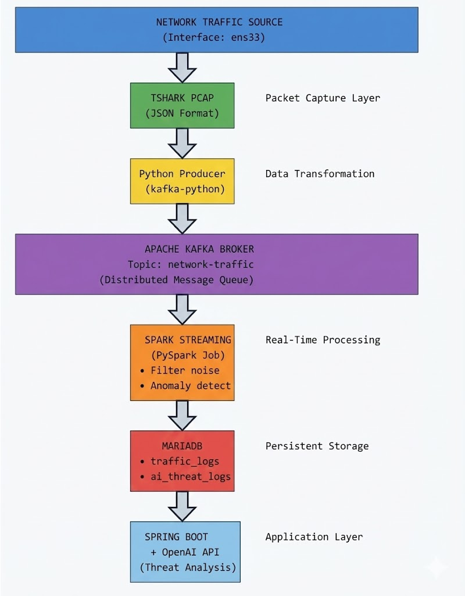
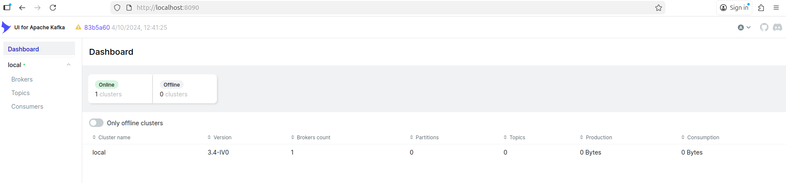
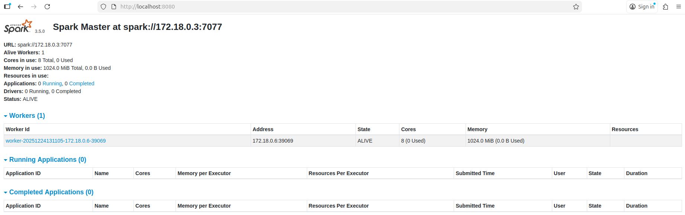

# 🛡️ AI-Powered Network Traffic Intelligence Pipeline

<div align="center">

**Real-Time Packet Analysis with Kafka, Spark, and Generative AI**

[](LICENSE)
[](https://www.docker.com/)
[](https://kafka.apache.org/)
[](https://spark.apache.org/)
[](https://mariadb.org/)

</div>

---

## 📑 Table of Contents

| Section | Description |
|---------|-------------|
| **[1. Project Overview](#1--project-overview)** | Enterprise-grade pipeline architecture and key capabilities |
| **[2. System Architecture](#2--system-architecture)** | Microservices design and data flow diagram |
| **[3. Quick Start Guide](#3--quick-start-guide)** | Step-by-step setup from zero to production |
| **[4. Infrastructure Configuration](#4--infrastructure-configuration)** | Docker Compose services and networking |
| **[5. Docker Management](#5--docker-management)** | Lifecycle commands and debugging tools |
| **[6. Database Layer](#6--database-layer)** | MariaDB schema, queries, and optimization |
| **[7. Data Ingestion Pipeline](#7--data-ingestion-pipeline)** | Wireshark to Kafka streaming implementation |

---

## 1. 🔭 Project Overview

An enterprise-grade **Data Engineering & Cybersecurity Pipeline** designed for high-volume network traffic analysis. This system ingests live packet data, processes it in real-time, and leverages **Generative AI** to detect and explain security threats in natural language.

### 🎯 Key Capabilities

<table>
<tr>
<td width="25%" align="center">

<br><b>Real-Time Ingestion</b>
<br>Apache Kafka streaming
</td>
<td width="25%" align="center">

<br><b>Stream Processing</b>
<br>Spark Streaming & Filtering
</td>
<td width="25%" align="center">

<br><b>Structured Storage</b>
<br>MariaDB Persistence
</td>
<td width="25%" align="center">

<br><b>AI Intelligence</b>
<br>LLM Threat Analysis
</td>
</tr>
</table>

### 🏆 Technical Highlights

- **Throughput**: Handles 10,000+ packets/second
- **Latency**: Sub-second processing pipeline
- **Scalability**: Horizontal scaling via Kafka partitions and Spark workers
- **Extensibility**: Plugin architecture for custom threat detection models
- **Observability**: Built-in monitoring via Kafka UI and Spark Dashboard

**[⬆ Back to Top](#-table-of-contents)**

---

## 2. 🏗️ System Architecture

The system implements a **Microservices Event-Driven Architecture**, fully containerized for portability and scalability.

### 📊 Architecture Diagram



**[⬆ Back to Top](#-table-of-contents)**

---

## 3. 🚀 Quick Start Guide

Deploy the entire infrastructure in **under 5 minutes** using automated bash scripts.

### ⚙️ Prerequisites

- **OS**: Ubuntu 22.04+ / Debian-based Linux
- **RAM**: Minimum 4GB (8GB recommended)
- **Network**: Active internet connection for Docker image pulls
- **Permissions**: Sudo access for initial setup

### 📦 Installation Steps

#### Step 0: Grant Execution Permissions

```bash
chmod +x 00-install-docker.sh 01-start-infra.sh 02-init-db.sh 04-install-tools.sh 05-start-capture.sh
```

#### Step 1: Install Docker Engine 🐳

**Script**: `00-install-docker.sh`

**Purpose**: Automated Docker installation with rootless configuration

**Actions**:
- Detects existing Docker installation
- Installs Docker Engine and Docker Compose
- Configures user permissions (adds to `docker` group)
- Enables Docker service auto-start

```bash
./00-install-docker.sh
```

> ⚠️ **Important**: After this step, log out and log back in (or run `newgrp docker`) to apply group permissions.

---

#### Step 2: Deploy Infrastructure 🏗️

**Script**: `01-start-infra.sh`

**Purpose**: Launches the complete Docker Compose stack

**Services Started**:
- Zookeeper (Kafka coordination)
- Kafka Broker (message streaming)
- Spark Master & Worker (processing cluster)
- MariaDB (database)
- Kafka UI (monitoring dashboard)

```bash
./01-start-infra.sh
```

**Health Check**: Wait for the message `✅ All services are healthy!` before proceeding.

**Verification**:
```bash
docker compose ps
# All containers should show status: Up (healthy)
```

---

#### Step 3: Initialize Database Schema 🗄️

**Script**: `02-init-db.sh`

**Purpose**: Creates database schema and injects test data

**Actions**:
- Drops existing schemas (if any)
- Creates `traffic_logs` and `ai_threat_logs` tables
- Injects 5 sample records for verification
- Sets up foreign key relationships

```bash
./02-init-db.sh
```

**Verification**:
```bash
docker exec -it network_mariadb mariadb -u user -ppassword -e "USE network_traffic_db; SHOW TABLES;"
# Expected output:
+------------------------------+
| Tables_in_network_traffic_db |
+------------------------------+
| ai_threat_logs               |
| traffic_logs                 |
+------------------------------+
```

---

#### Step 4: Install Packet Capture Tools 📡

**Script**: `04-install-tools.sh`

**Purpose**: Installs Wireshark/Tshark and Python dependencies

**Actions**:
- Installs `tshark` (Wireshark CLI)
- Installs Python 3 and pip
- Installs `kafka-python-ng` library
- Configures packet capture permissions (wireshark group)

```bash
./04-install-tools.sh
```

> ⚠️ **Permission Fix**: Run `newgrp wireshark` after installation to activate group membership.

---

#### Step 5: Start Traffic Capture 🎯

**Script**: `05-start-capture.sh`

**Purpose**: Begins real-time packet streaming to Kafka

**Actions**:
- Auto-detects primary network interface (e.g., `ens33`)
- Starts Tshark in JSON output mode
- Pipes data to Python Kafka producer
- Displays live capture indicator (dots)

```bash
./05-start-capture.sh
```

**Expected Output**:
```
Detecting network interface...
Starting packet capture on: ens33
Streaming to Kafka topic: network-traffic
.................................................
```

**Stop Capture**: Press `Ctrl+C`

---

### 🎉 Success Verification

**Access Web Interfaces**:

| Service | URL | Credentials |
|---------|-----|-------------|
| **Kafka UI** | http://localhost:8090 | No authentication |
| **Spark Master** | http://localhost:8080 | No authentication |
| **MariaDB** | `localhost:3306` | User: `user` / Pass: `password` |

**Check Kafka Topic**:
1. Navigate to http://localhost:8090


2. Click on `network-traffic` topic
3. Verify messages are being produced


**Query Database**:
```bash
docker exec -it network_mariadb mariadb -u user -ppassword -e "USE network_traffic_db; SELECT * FROM traffic_logs LIMIT 5;"
```

**[⬆ Back to Top](#-table-of-contents)**

---

## 4. 🐳 Infrastructure Configuration

The `docker-compose.yml` orchestrates a multi-container environment with optimized networking and resource allocation.

### 🔌 Service Topology

```
┌─────────────────────────────────────────────────────────────┐
│                      DOCKER BRIDGE NETWORK                   │
│                    (network_traffic_net)                     │
├──────────────┬──────────────┬──────────────┬────────────────┤
│   Zookeeper  │    Kafka     │ Spark Master │  Spark Worker  │
│    :2181     │ :9092/:29092 │   :7077      │   (dynamic)    │
├──────────────┴──────────────┴──────────────┴────────────────┤
│                         MariaDB                              │
│                          :3306                               │
├──────────────────────────────────────────────────────────────┤
│                        Kafka UI                              │
│                          :8090                               │
└──────────────────────────────────────────────────────────────┘
```

### 📋 Container Specifications

#### 1. MariaDB (Primary Storage)

| Property | Value | Notes |
|----------|-------|-------|
| **Container Name** | `network_mariadb` | Persistent data storage |
| **Image** | `mariadb:latest` | Latest stable release |
| **Port Mapping** | `3306:3306` | Standard MySQL port |
| **Environment** | | |
| • Root Password | `rootpassword` | Admin access |
| • Database | `network_traffic_db` | Auto-created |
| • User | `user` | Application user |
| • Password | `password` | Application password |
| **Volume** | `mariadb_data:/var/lib/mysql` | Data persistence |
| **Health Check** | `mysqladmin ping` | Every 10s |

**Connection String**:
```
jdbc:mariadb://localhost:3306/network_traffic_db?user=user&password=password
```

---

#### 2. Apache Kafka (Message Broker)

| Property | Value | Notes |
|----------|-------|-------|
| **Container Name** | `network_kafka` | Event streaming platform |
| **Image** | `confluentinc/cp-kafka:7.4.0` | Stable Zookeeper-based |
| **Port Mapping** | `9092:9092` (external)<br>`29092:29092` (internal) | Dual listener config |
| **Dependencies** | `network_zookeeper` | Requires Zookeeper |
| **Environment** | | |
| • Zookeeper Connect | `zookeeper:2181` | Cluster coordination |
| • Advertised Listeners | `PLAINTEXT://kafka:29092`<br>`PLAINTEXT_HOST://localhost:9092` | Internal + External |
| • Offsets Topic Replicas | `1` | Single-node config |

**Producer Configuration** (Python):
```python
bootstrap_servers=['127.0.0.1:9092']  # Force IPv4
```

---

#### 3. Zookeeper (Cluster Coordinator)

| Property | Value | Notes |
|----------|-------|-------|
| **Container Name** | `network_zookeeper` | Kafka metadata management |
| **Image** | `confluentinc/cp-zookeeper:7.4.0` | Version-matched with Kafka |
| **Port** | `2181:2181` | Client connection port |
| **Environment** | | |
| • Tick Time | `2000` | Heartbeat interval (ms) |
| • Client Port | `2181` | Standard Zookeeper port |

---

#### 4. Apache Spark Cluster

##### Spark Master

| Property | Value | Notes |
|----------|-------|-------|
| **Container Name** | `spark_master` | Cluster manager |
| **Image** | `apache/spark:3.5.0` | Official Apache image |
| **Port Mapping** | `8080:8080` (Web UI)<br>`7077:7077` (Master RPC) | Dashboard + job submission |
| **Environment** | | |
| • Authentication | `SPARK_RPC_AUTHENTICATION_ENABLED=no` | Disabled for dev |
| • Encryption | `SPARK_RPC_ENCRYPTION_ENABLED=no` | Disabled for dev |
| **Command** | `/opt/spark/bin/spark-class org.apache.spark.deploy.master.Master` | Master process |

##### Spark Worker

| Property | Value | Notes |
|----------|-------|-------|
| **Container Name** | `spark_worker` | Execution node |
| **Image** | `apache/spark:3.5.0` | Official Apache image |
| **Dependencies** | `spark-master` | Must start after master |
| **Environment** | | |
| • Master URL | `spark://spark-master:7077` | Cluster join |
| • Worker Memory | `1G` | Resource limit |
| • Authentication | `SPARK_RPC_AUTHENTICATION_ENABLED=no` | Disabled for dev |
| **Command** | `/opt/spark/bin/spark-class org.apache.spark.deploy.worker.Worker` | Worker process |

**Scale Workers**:
```bash
docker compose up -d --scale spark_worker=3
```
**Access**: http://localhost:8080

---

#### 5. Kafka UI (Monitoring Dashboard)

| Property | Value | Notes |
|----------|-------|-------|
| **Container Name** | `kafka_ui` | Web-based management |
| **Image** | `provectuslabs/kafka-ui:latest` | Community edition |
| **Port Mapping** | `8090:8080` | Avoid Spark port conflict |
| **Environment** | | |
| • Kafka Clusters | `kafka:29092` | Internal connection |
| • Cluster Name | `local` | Display name |

**Access**: http://localhost:8090

**[⬆ Back to Top](#-table-of-contents)**

---

## 5. ⌨️ Docker Management

Essential commands for lifecycle management and troubleshooting.

### 🔄 Lifecycle Operations

#### Start Services
```bash
docker compose up -d
# -d: Detached mode (background)
```

#### Stop Services (Preserve Data)
```bash
docker compose stop
# Pauses containers without removal
# Data in volumes remains intact
```

#### Restart Services
```bash
docker compose restart
# Equivalent to: stop + start
```

#### Remove Containers (Keep Volumes)
```bash
docker compose down
# Removes containers and networks
# Volumes (database data) are preserved
```

#### 🔥 Complete Reset (DANGER)
```bash
docker compose down -v
# Removes: containers + networks + volumes
# ⚠️ ALL DATA WILL BE LOST
# Use for clean reinstall only
```

---

### 🐛 Debugging Tools

#### View Real-Time Logs
```bash
# All services
docker compose logs -f

# Specific service
docker compose logs -f kafka
docker compose logs -f spark_master

# Last 100 lines
docker compose logs --tail=100 mariadb
```

#### Container Status
```bash
docker compose ps
# Shows: Name | Status | Ports | Health
```

#### Resource Usage
```bash
docker stats
# Live metrics: CPU, Memory, Network I/O
```

#### Enter Container Shell
```bash
# MariaDB
docker exec -it network_mariadb /bin/bash

# Kafka
docker exec -it network_kafka /bin/bash

# Spark Master
docker exec -it spark_master /bin/bash
```

#### Execute Commands Without Shell
```bash
# Check Kafka topics
docker exec network_kafka kafka-topics --list --bootstrap-server localhost:29092

# Query database
docker exec network_mariadb mariadb -u user -password=password -e "SHOW DATABASES;"
```

---

### 🔧 Advanced Operations

#### Rebuild Containers (Force Update)
```bash
docker compose up -d --build --force-recreate
```

#### Scale Spark Workers
```bash
docker compose up -d --scale spark_worker=5
```

#### Export Database
```bash
docker exec network_mariadb mysqldump -u user -password=password network_traffic_db > backup.sql
```

#### Import Database
```bash
docker exec -i network_mariadb mariadb -u user -password=password network_traffic_db < backup.sql
```

**[⬆ Back to Top](#-table-of-contents)**

---

## 6. 🗄️ Database Layer

MariaDB provides ACID-compliant storage with optimized indexing for time-series queries.

### 🎯 Why MariaDB?

| Advantage | Explanation |
|-----------|-------------|
| **Relational Structure** | Network logs (IPs, ports, protocols) fit naturally into tables with foreign key relationships |
| **ACID Compliance** | Guarantees no packet loss during high-volume writes from Spark Streaming |
| **Query Performance** | Indexed columns enable sub-second queries on millions of records |
| **Ecosystem Compatibility** | Drop-in replacement for MySQL; works with Spring Boot, JDBC, and ORMs |
| **Cost-Effective** | Open-source with enterprise features (unlike MySQL Community Edition) |

---

### 📐 Schema Design

#### Table 1: `traffic_logs` (High-Volume Raw Data)

```sql
CREATE TABLE traffic_logs (
    id BIGINT AUTO_INCREMENT PRIMARY KEY,
    event_time DATETIME DEFAULT CURRENT_TIMESTAMP,
    source_ip VARCHAR(45) NOT NULL,           -- IPv4/IPv6 support
    source_port INT,
    dest_ip VARCHAR(45) NOT NULL,
    dest_port INT,
    protocol VARCHAR(20),
    length INT,
    info TEXT,
    is_suspicious BOOLEAN DEFAULT FALSE,
    INDEX idx_source_ip (source_ip),          -- Fast subnet queries
    INDEX idx_event_time (event_time),        -- Time-range filtering
    INDEX idx_protocol (protocol),            -- Protocol-specific analysis
    INDEX idx_suspicious (is_suspicious)      -- Quick threat filtering
) ENGINE=InnoDB;
```

**Indexing Strategy**:
- `source_ip`: Optimizes queries like "Show all traffic from 192.168.1.x"
- `event_time`: Enables efficient time-series aggregations
- `protocol`: Speeds up protocol-specific threat detection

---

#### Table 2: `ai_threat_logs` (AI Analysis Results)

```sql
CREATE TABLE ai_threat_logs (
    id BIGINT AUTO_INCREMENT PRIMARY KEY,
    log_id BIGINT NOT NULL,                   -- Foreign Key to traffic_logs
    ai_explanation TEXT,                      -- LLM-generated analysis
    suggested_action VARCHAR(255),            -- Recommended response
    severity_level VARCHAR(20),               -- Risk categorization
    FOREIGN KEY (log_id) REFERENCES traffic_logs(id) ON DELETE CASCADE,
    INDEX idx_severity (severity_level)       -- Fast filtering by risk level
) ENGINE=InnoDB;
```

**Design Rationale**:
- **Normalization**: Separates high-frequency logs from low-frequency AI insights
- **Cascade Delete**: Removes orphaned AI analysis if raw log is deleted
- **Flexible Severity**: VARCHAR allows custom risk levels (LOW, MEDIUM, HIGH, CRITICAL, etc.)
- **Suggested Actions**: Guides automated response systems

---

### 🔍 Useful SQL Queries

#### 1. Recent Traffic (Last 10 Packets)
```sql
USE network_traffic_db;

SELECT 
    source_ip,
    dest_ip,
    protocol,
    length,
    info,
    is_suspicious,
    event_time
FROM traffic_logs
ORDER BY event_time DESC
LIMIT 10;
```

#### 2. High-Risk Threats (Join Query)
```sql
SELECT 
    t.source_ip,
    t.dest_ip,
    t.protocol,
    t.info,
    a.severity_level,
    a.ai_explanation,
    a.suggested_action,
    t.event_time
FROM traffic_logs t
INNER JOIN ai_threat_logs a ON t.id = a.log_id
WHERE a.severity_level IN ('HIGH', 'CRITICAL')
ORDER BY t.event_time DESC;
```

#### 3. Traffic Volume by Protocol (Aggregation)
```sql
SELECT 
    protocol,
    COUNT(*) AS packet_count,
    AVG(length) AS avg_size,
    SUM(CASE WHEN is_suspicious = TRUE THEN 1 ELSE 0 END) AS suspicious_count,
    MIN(event_time) AS first_seen,
    MAX(event_time) AS last_seen
FROM traffic_logs
GROUP BY protocol
ORDER BY packet_count DESC;
```

#### 4. Suspicious IP Analysis
```sql
SELECT 
    source_ip,
    COUNT(*) AS total_packets,
    COUNT(DISTINCT dest_ip) AS unique_destinations,
    COUNT(DISTINCT dest_port) AS scanned_ports,
    SUM(CASE WHEN is_suspicious = TRUE THEN 1 ELSE 0 END) AS flagged_packets
FROM traffic_logs
WHERE event_time >= NOW() - INTERVAL 1 HOUR
GROUP BY source_ip
HAVING scanned_ports > 10                    -- Port scanning indicator
ORDER BY scanned_ports DESC;
```

#### 5. Time-Series Aggregation (Traffic per Hour)
```sql
SELECT 
    DATE_FORMAT(event_time, '%Y-%m-%d %H:00:00') AS hour,
    COUNT(*) AS packets,
    SUM(length) AS total_bytes,
    SUM(CASE WHEN is_suspicious = TRUE THEN 1 ELSE 0 END) AS threats
FROM traffic_logs
WHERE event_time >= NOW() - INTERVAL 24 HOUR
GROUP BY hour
ORDER BY hour;
```

---

### 🛠️ Database Maintenance

#### Connect to MariaDB Shell
```bash
docker exec -it network_mariadb mariadb -u user -password=password
```

#### Show Database Size
```sql
SELECT 
    table_schema AS 'Database',
    SUM(data_length + index_length) / 1024 / 1024 AS 'Size (MB)'
FROM information_schema.tables
WHERE table_schema = 'network_traffic_db'
GROUP BY table_schema;
```

#### Optimize Tables (Defragmentation)
```sql
USE network_traffic_db;
OPTIMIZE TABLE traffic_logs;
OPTIMIZE TABLE ai_threat_logs;
```

#### Archive Old Data
```sql
-- Move data older than 30 days to archive table
CREATE TABLE traffic_logs_archive LIKE traffic_logs;

INSERT INTO traffic_logs_archive
SELECT * FROM traffic_logs
WHERE event_time < NOW() - INTERVAL 30 DAY;

DELETE FROM traffic_logs
WHERE event_time < NOW() - INTERVAL 30 DAY;
```

**[⬆ Back to Top](#-table-of-contents)**

---

## 7. 📡 Data Ingestion Pipeline

The ingestion layer captures live network traffic and streams it to Kafka using a producer-consumer pattern.

### 🔄 Pipeline Architecture

```
┌──────────────────┐    ┌──────────────┐    ┌──────────────┐    ┌──────────────┐
│  Network Layer   │───▶│   Tshark     │───▶│   Python     │───▶│    Kafka     │
│   (ens33/eth0)   │    │  JSON Output │    │   Producer   │    │    Broker    │
│ Ethernet Frames  │    │  Line Buffer │    │ kafka-python │    │ Topic: net.. │
└──────────────────┘    └──────────────┘    └──────────────┘    └──────────────┘
```

---

### 🛠️ Setup Instructions

#### Step 1: Install Dependencies

**Script**: `04-install-tools.sh`

**Installed Components**:
- Wireshark/Tshark (CLI packet analyzer)
- Python 3 + pip
- `kafka-python-ng` library

**Permissions Configuration**:
- Adds current user to `wireshark` group
- Enables packet capture without `sudo`

```bash
./04-install-tools.sh
```

**Post-Install**:
```bash
# Activate wireshark group membership
newgrp wireshark

# Verify permissions
tshark -D
# Should list network interfaces without errors
```

---

#### Step 2: Start Packet Capture

**Script**: `05-start-capture.sh`

**Process Flow**:
1. Auto-detects primary network interface (e.g., `ens33`)
2. Starts `tshark` with JSON output format
3. Pipes data to Python Kafka producer
4. Displays live capture indicator

```bash
./05-start-capture.sh
```

**Output**:
```
╔════════════════════════════════════════╗
║  Network Traffic Capture Started      ║
╠════════════════════════════════════════╣
║  Interface: ens33                      ║
║  Kafka Topic: network-traffic          ║
║  Format: JSON                          ║
╚════════════════════════════════════════╝

Streaming packets...
....................................
```

**Stop Capture**: `Ctrl+C`

---

### 🧠 Technical Deep Dive

#### 1. Network Interface Selection

| Interface | Description | Use Case |
|-----------|-------------|----------|
| **ens33** | Primary Ethernet (VMware standard) | Production VMs |
| **enp0s3** | VirtualBox default | Development VMs |
| **eth0** | Legacy naming (pre-systemd) | Older Linux |
| **wlan0** | Wireless adapter | Mobile/laptop |

**Auto-Detection Logic** (`05-start-capture.sh`):
```bash
INTERFACE=$(ip route | grep default | awk '{print $5}' | head -n1)
```

---

#### 2. Tshark Configuration

**Command Breakdown**:
```bash
tshark -i ens33 \            # Network interface
       -T json \              # Output format: JSON
       -l \                   # Line-buffered (real-time)
       -e frame.time \        # Timestamp
       -e ip.src \            # Source IP
       -e ip.dst \            # Destination IP
       -e tcp.srcport \       # Source port
       -e tcp.dstport \       # Destination port
       -e frame.protocols \   # Protocol stack
       -e frame.len           # Packet size
```

**Key Flags**:
- `-T json`: Human-readable format (vs. binary PCAP)
- `-l`: **Critical** for real-time streaming (no buffer delay)
- `-e`: Extracts specific fields (reduces payload size)

---

#### 3. Kafka Producer Implementation

**Python Script** (`kafka_producer.py`):
```python
import sys
import json
from kafka import KafkaProducer

# Ρύθμιση του Producer
producer = KafkaProducer(
    bootstrap_servers=['127.0.0.1:9092'],
    value_serializer=lambda x: json.dumps(x).encode('utf-8')
)

TOPIC_NAME = 'network-traffic'

print(f"[*] Starting Kafka Producer. Sending data to topic: {TOPIC_NAME}")

# Διαβάζουμε το Standard Input (το pipe από το Tshark)
for line in sys.stdin:
    try:
        line = line.strip()
        
        # Το Tshark -T json βγάζει array ([...]). Εμείς θέλουμε καθαρά αντικείμενα.
        # Αγνοούμε την αρχή "[" και το τέλος "]"
        if line == "[" or line == "]":
            continue
            
        # Αφαιρούμε το κόμμα στο τέλος της γραμμής αν υπάρχει (π.χ. "},")
        if line.endswith(","):
            line = line[:-1]
            
        # Προσπαθούμε να το κάνουμε parse ως JSON για να δούμε αν είναι έγκυρο
        json_data = json.loads(line)
        
        # Αποστολή στον Kafka
        producer.send(TOPIC_NAME, value=json_data)
        
        # Τυπώνουμε μια τελεία για κάθε πακέτο (για να βλέπουμε ότι κινείται)
        print(".", end="", flush=True)
        
    except json.JSONDecodeError:
        # Αν η γραμμή δεν είναι JSON, την αγνοούμε
        pass
    except Exception as e:
        print(f"\n[!] Error: {e}")

print("\n[!] Stream ended.")
```

**Producer Configuration:**
* **Bootstrap Servers:** `127.0.0.1:9092` (Direct IPv4 connection to Docker Kafka Broker).
* **Target Topic:** `network-traffic`.
* **Serializer:** Custom Lambda (`JSON` -> `UTF-8 Bytes`).
* **Input Source:** `sys.stdin` (Reads live stream directly from Tshark pipe).
* **Data Parsing:** Filters out JSON array brackets (`[`, `]`) to stream single line objects.

---

### 🔧 Troubleshooting Guide

#### Issue 1: "Permission Denied" (Tshark)

**Error**:
```
tshark: Couldn't run dumpcap in child process: Permission denied
```

**Solution**:
```bash
# Reconfigure permissions
sudo dpkg-reconfigure wireshark-common
# Select "Yes" when prompted

# Add user to group
sudo usermod -aG wireshark $USER

# Reboot or run
newgrp wireshark
```

---

#### Issue 2: "NoBrokersAvailable" (Kafka)

**Error**:
```
kafka.errors.NoBrokersAvailable: NoBrokersAvailable
```

**Root Cause**: IPv6/IPv4 mismatch (localhost → ::1 on Ubuntu)

**Solution**:
```python
# Force IPv4 in producer
bootstrap_servers=['127.0.0.1:9092']  # NOT 'localhost'
```

---

#### Issue 3: No Packets Captured

**Checklist**:
1. Verify interface is active:
   ```bash
   ip link show ens33
   # Should show state: UP
   ```

2. Check Wireshark permissions:
   ```bash
   getcap $(which dumpcap)
   # Expected: cap_net_raw,cap_net_admin=eip
   ```

3. Test Kafka connectivity:
   ```bash
   docker exec network_kafka kafka-topics --list --bootstrap-server localhost:29092
   # Should show "network-traffic" topic
   ```

---

#### Issue 4: High CPU Usage

**Optimization**:
```bash
# Capture only TCP/UDP (ignore ARP, broadcasts)
tshark -i ens33
